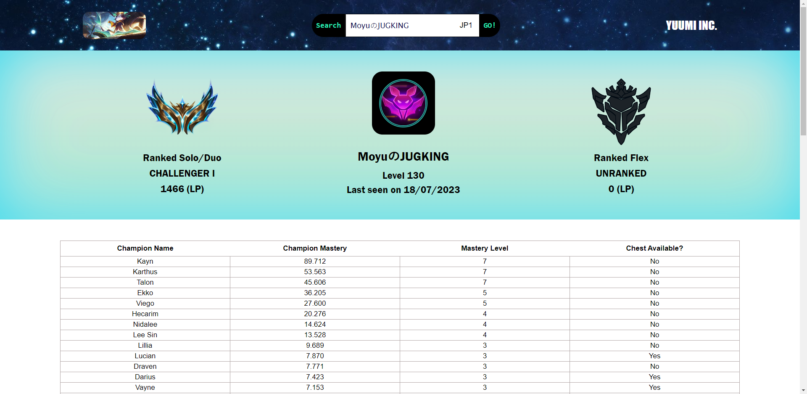
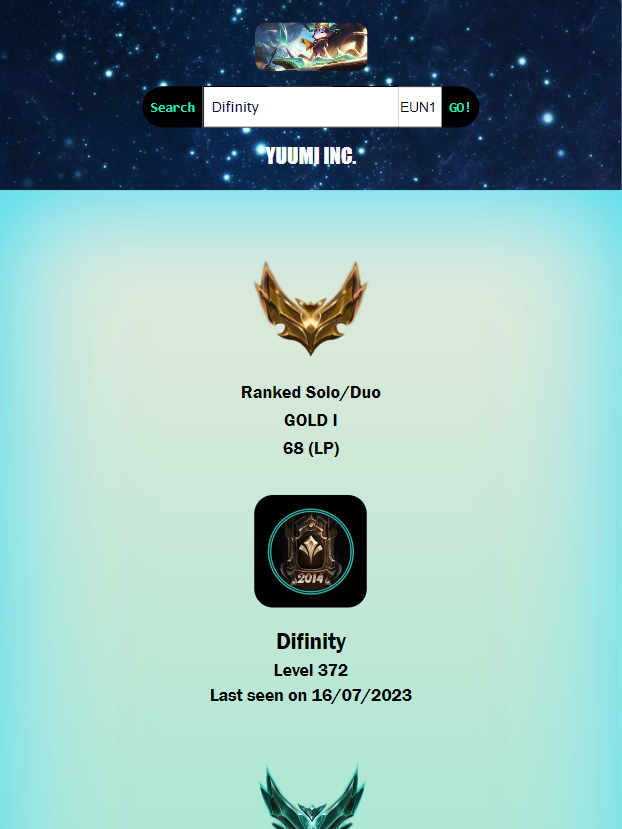

# Getting Started with Vite & React

Yuumisteries was designed with [Create React App](https://create-react-app.dev/docs/getting-started) and [Vite](https://vitejs.dev/guide/#index-html-and-project-root). Don't try to move the public.html folder inside the public directory. Vite treats index.html as source code and part of the module graph.

It's a short League of Legends project-analyser of a player's current masteries.

After configuring the .env file in the backend with the desired ROUTE & the riot API key you can:

## Available Scripts

In the project directory, you can run:

### `npm run start`

Kickstarts the app in dev mode.\
Open [http://localhost:3000](http://localhost:3000) to view it in your browser.

The page will reload when you make changes.\
You may also see any lint errors in the console.

### `npm test`

Launches the test runner in the interactive watch mode.\
See the section about [running tests](https://facebook.github.io/create-react-app/docs/running-tests) for more information.

### `npm run build`

Builds the app for production to the `build` folder.\
It correctly bundles React in production mode and optimizes the build for the best performance.

The build is minified and the filenames include the hashes.\
Your app is ready to be deployed!

See the section about [deployment](https://facebook.github.io/create-react-app/docs/deployment) for more information
